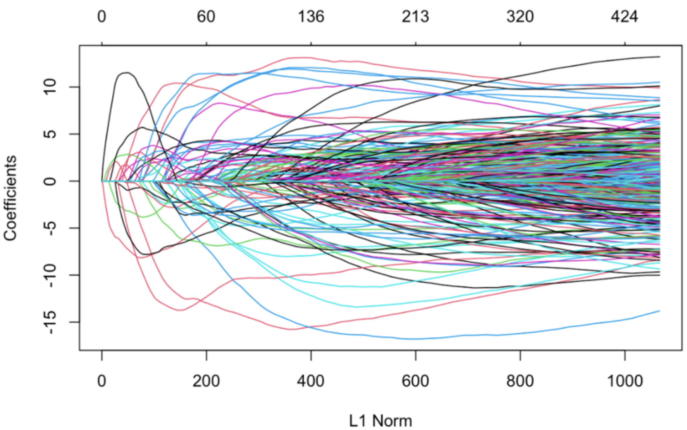
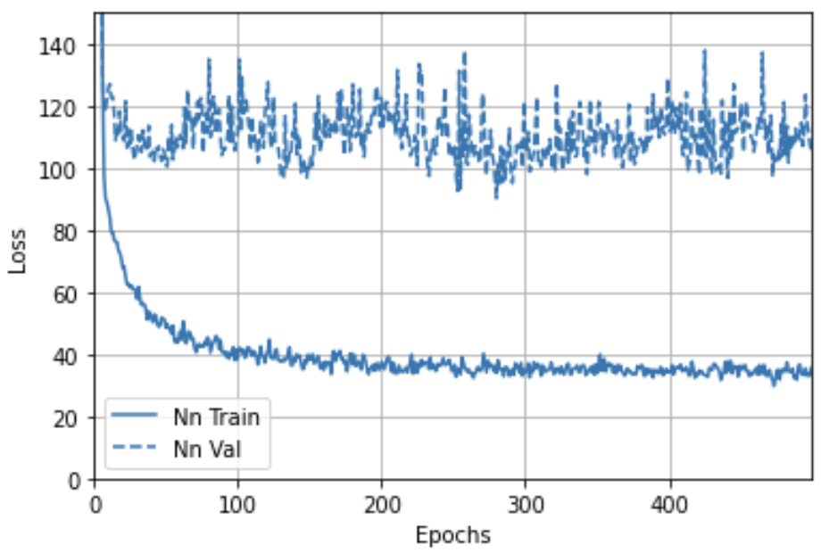
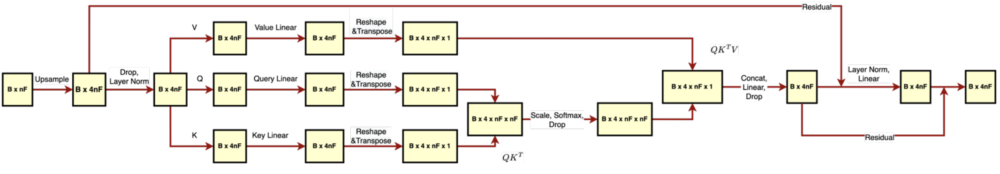
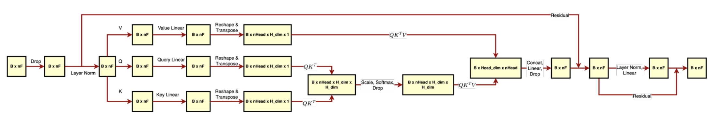
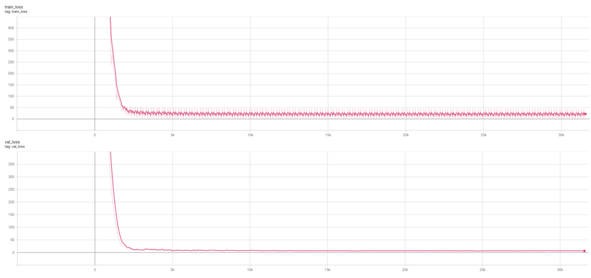
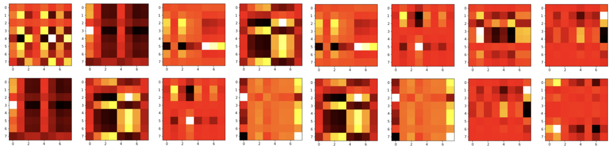
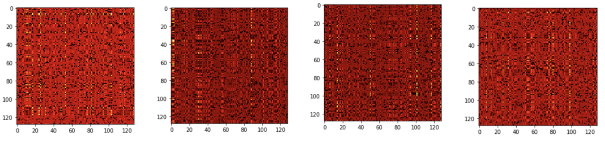

# Epigenetic_Clocks

## Project Structure
In this repository, you will find 3 folders.
The first folder, "Regressor and dataset in R" contains R markdown notebook with penalized linear regression implementation as well as the code for collecting the dataset.

The second folder, "Dataset construction" contains a Python notebook with some hybrid cells that use R for dataset normalization

The third folder, "Models", which is probably the most interesting, contains the MLP as well as multiple transformer encoder models.

The pre-trained models and the pre-processed datasets are available via the public link below:
https://drive.google.com/drive/folders/11JlLkkm6oNcmSivNUq0Nyb25hPNxg45M?usp=share_link

Note that the link has 2 dataset files, "large_dataset.pkl" and "best_dataframe.csv" are essentially the same, but the names are different to make them compatible with the code.

If you have any questions, feel free to reach out (winterblizzard19@gmail.com)

## Usage
In order to successfully run the code in this repository, you will need to complete the following steps:

1. Clone the repository into your local machine.
2. In the root folder of the repository, unzip the Dataset.zip file.
3. Set up python virtual environment with the following commands:

```
python -m venv .venv
source ./.venv/bin/activate
pip install -r requirements.txt
```
4. After activating the environment and installing the dependencies, you can connect to the Jupyter Kernel and run the provided .ipynb notebooks.

# Results

DNA methylation is one of the main hallmarks of aging and is believed to influence the development of age-related diseases. Here, we improve the accuracy of age inference from DNA methylation by utilizing multilayer transformer encoder with learnable down sampling. Our model achieves median absolute error below 0.5 years and outperforms the penalized linear regression and multilayer perceptron in predicting the age based on the DNA methylation values. Further, we visualize the self-attention scores calculated by the transformer architecture, revealing potential interactions among the CpG methylation sites.

## Penalized linear regression

First, we set out to reproduce the results from Horvath by training Elastic Net, a penalized linear regression implemented
in the glmnet package in R. In the setting of the elastic net, the loss is minimized over the grid of multiple possible regularization weights "lambda." The penalty varies between lasso or L1 regularization (α = 1) and ridge or L2 regularization (α = 0). We used the α value
0.5, which is the middle ground between these two regularization methods. Elastic Net, therefore, learns to select only the most relevant CpG sites (Figure 1) and applies the weights β to infer the age.



Figure 1. The coefficients of the linear regression and the L1 norm with varying lambda

##  Multilayer perceptron

Next, we reproduced the results from Camillo et al. by training a multilayer perceptron. Each of the five hidden layers had 32 neurons, followed by the Gaussian dropout layer, batch normalization layer, and SeLU (scaled exponential linear unit) activation. The perceptron was trained for 500 epochs using the Adam optimizer with a 0.002 learning rate. However, no improvement was observed after 300 epochs (Figure 2).



Figure 2. Training and validation loss of the multilayer perceptron

## Transformer encoder
The main obstacle to applying a transformer encoder to our data is the extremely high number of CpG sites (18294).
The RAM requirements of conventional systems cannot accommodate the transformer model when attempting to
process the input tensor. To resolve this issue, we came up with two main strategies. The first strategy involved applying
the Principal Component Analysis to obtain the dataset with fewer features. The second strategy entailed a "learnable
down sampling," which was implemented with a linear layer that projects the 18294 – dimensional input into a lower,
256 - dimensional space.

We then designed two transformer encoder architectures with different implementations of self-attention. Overall, both
architectures follow a similar overarching design which involves stacking N transformer encoder layers. From now on, we refer to these architectures as transformer encoder A and transformer encoder B.

## Transformer Encoder A.
The first implementation of the transformer encoder involves calculating self-attention over all CpG sites of the input.
(Figure 3). This architecture was tested with 1 head and 128 hidden dimensions corresponding to the PCA-processed 128-dimensional dataset. In addition, we evaluated this architecture with 4 heads and 4*128 hidden dimensions corresponding to up sampled data with 128 columns. Finally, we trained this architecture with 1 attention head, 256 hidden dimensions, and learnable feature down-sampling performed by the fully connected layer. In addition, we applied the “all CpG attention” architecture to the original 18294-dimensional dataset after adding a fully connected layer that projects the data points down to the 256-dimensional space.


Figure 3. 4-headed self-attention across all CpG sites (Transformer A). The self-attention matrix QxK.t has 4 x nF x nF dimensions, meaning that it has 4 attention scores for each CpG pair

## Transformer Encoder B.
The second implementation involves distributing the CpG sites into 16 unique partitions, one for each attention head (Figure 4). The self-attention is then calculated only between the pairs of CpG sites in the same partition. We evaluated this architecture with 128, 256, and 512 hidden dimensions corresponding to the number of columns in datasets with reduced dimensions. The direct correspondence of the hidden dimension to the number of columns was chosen to increase the interpretability of the attention.


Figure 4. Partitioned attention (Transformer B). CpG sites are distributed into nHead unique partitions. Selfattention is calculated only between the pairs of CpG sites in the same partition.

Both transformer architectures were trained for 500 or 1000 epochs using Adam optimizer with a 0.0001 learning rate.


Figure 5. The training and validation loss of Transformer A with 128 hidden dimensions, 1 attention head, and learnable down sampling.

# Performance evaluation

Following training, the median absolute error of each model is as follows:


| Architecture                                      | Median absolute error, years |
|---------------------------------------------------|------------------------------|
| Linear regression                                 | 1.0263                       |
| Transformer Encoder B (256 hidden dimensions, learnable down sampling) | 3.0730  |
| Multilayer perceptron                             | 3.4164                       |
| Transformer Encoder B (128 hidden dimensions, PCA) | 15.2848                     |
| Transformer Encoder B (256 hidden dimensions, PCA) | 15.1529                     |
| Transformer Encoder B (512 hidden dimensions, PCA) | 15.1408                     |
| Transformer Encoder A (1 head, 128 hidden dimensions, PCA) | 15.2431             |
| Transformer Encoder A (4 heads, 512 hidden dimensions, PCA) | 16.0375            |
| Transformer Encoder A (1 head, 256 hidden dimensions, learnable down sampling) | 0.4895 |

The best performer by far was Transformer Encoder A with 1 head and 256 hidden dimensions. It achieved a stellar 0.4895 median absolute error, beating the second best model by more than 2-fold. The second-best model was penalized linear regression. Linear regression achieved a median error of just over one year. Linear regression identified 460 genomic locations which have high relevance to the prediction of age. Curiously, only
4 of these sites happen to coincide with the results of Horvath. This is likely due to the difference of our datasets. The third-best performer was Transformer Encoder B with learnable down sampling, which achieved a median error of about three years and managed to narrowly outperform the linear regressor with 3.4 median error. However, all the other transformer architectures which relied on the principal component analysis for the dimensionality reduction performed significantly worse, with a median absolute error of 15 years or more. This result demonstrates that the CpG methylation data is highly nonlinear, explaining the loss of relevant information, which results in poor performance of the models. The number of hidden dimensions did not have a very pronounced effect on the model's performance; however, the increase in the number of hidden dimensions led to a slight but consistent improvement in the performance of Transformer Encoder B.

## Attention heat maps

In addition to evaluating the accuracy of the trained transformers, we extracted the scaled and "soft maxed" selfattention, or Q x K.t, from the first encoder layer of each model. Visualizing attention maps (Figures 6, 7) is essential for model interpretability since it reveals the transformer-perceived mutual relevance of the CpG sites. Furthermore, this has a solid potential to accelerate the rate of biomedical discovery by demonstrating the potential coregulation of the genes proximal to these CpG sites.



Figure 6. Visualization of the attention map (QxK.t after applying scaling and soft max) produced by the first encoder layer of Transformer B with 128 hidden dimensions. Each of the 128 hidden dimensions is partitioned into 16 heads, each having 16 CpG site representations. The attention score is calculated for each pair of CpG sites within the partition and can be interpreted as the relevance of the two sites to each other.



Figure 7. Visualization of the attention map (QxKT after applying scaling and soft max) produced by the first encoder layer of Transformer A with 4*128 hidden dimensions and 4 heads. Each head receives 128 hidden dimensions, the same as the input dimension of the data. In other words, each head can calculate the attention score for each pair of CpG site representations in the input.